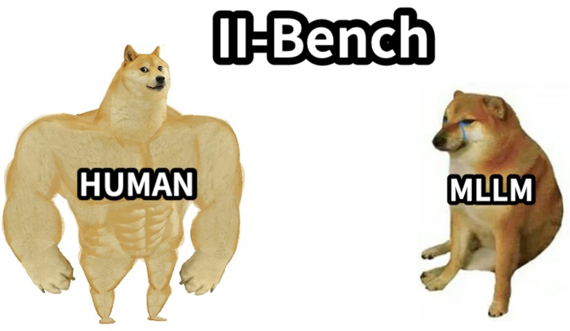

# II-Bench
[**🌐 Homepage**](https://ii-bench.github.io) | [**🤗 Dataset**](https://huggingface.co/datasets/m-a-p/II-Bench) | [**🤗 Paper**](https://huggingface.co/papers/2406.05862) | [**📖 arXiv**](https://arxiv.org/abs/2406.05862) | [**GitHub**](https://github.com/II-Bench/II-Bench) | [**EvalAI**](https://eval.ai/web/challenges/challenge-page/2334/overview)


This repo contains the evaluation code for the paper "[II-Bench: An Image Implication Understanding Benchmark for Multimodal Large Language Models](https://arxiv.org/abs/2406.05862)"
## 🔔News
- 🔥[2024/6/26]: We released [II-Bench](https://eval.ai/web/challenges/challenge-page/2334/overview) challenge on [EvalAI](https://eval.ai/). You can submit your results and evaluate them there.
- 🔥[2024/6/25]: We added the results of latest Claude 3.5 Sonnet, which achieved the SOTA performance among all models so far.

## Introduction
In recent years, the development of Multimodal Large Language Models (MLLMs) has significantly advanced our ability to understand and generate content across various modalities, yet evaluating their higher-order perceptual capabilities remains a challenge. To address this, we introduce II-Bench, a comprehensive benchmark designed to assess MLLMs' advanced perceptual, reasoning, and comprehension abilities through a diverse set of 1,222 images spanning six domains. Our extensive experiments on 20 MLLMs reveal significant performance gaps between models and humans, particularly in abstract domains like Art and Psychology. Our findings highlight the need for improved emotional understanding in MLLMs and suggest that incorporating emotional polarity information can enhance model performance. II-Bench aims to inspire advancements in multimodal AI research and foster the development of more sophisticated artificial general intelligence (AGI).

<p align="center">
  
</p>

## 🏆 Mini-Leaderboard
| Open-source Models        | Score |
|---------------------------|-------|
| InstructBLIP-T5-XL        | 47.3  |
| BLIP-2 FLAN-T5-XL         | 52.8  |
| mPLUGw-OWL2               | 53.2  |
| Qwen-VL-Chat              | 53.4  |
| InstructBLIP-T5-XXL       | 56.7  |
| Mantis-8B-siglip-Llama3   | 57.5  |
| BLIP-2 FLAN-T5-XXL        | 57.8  |
| DeepSeek-VL-Chat-7B       | 60.3  |
| Yi-VL-6B-Chat             | 61.3  |
| InternLM-XComposer2-VL    | 62.1  |
| InternVL-Chat-1.5         | 66.3  |
| Idefics2-8B               | 67.7  |
| Yi-VL-34B-Chat            | 67.9  |
| MiniCPM-Llama3-2.5        | 69.4  |
| CogVLM2-Llama3-Chat       | 70.3  |
| LLaVA-1.6-34B             |**73.8**|
| **Closed-source Models**  |**Score**|
| GPT-4V                    | 65.9  |
| GPT-4o                    | 72.6  |
| Gemini-1.5 Pro            | 73.9  |
| Qwen-VL-MAX               | 74.8  |
| Claude 3.5 Sonnet         |**80.9**|


## Installation
```python
pip install -r requirements.txt
```
Specifically, if you need to run the `Yi-VL` model, please refer to the link [here](https://github.com/01-ai/Yi/blob/main/VL/README.md) to configure your environment.

## Inference
You can directly perform inference on `Yi-VL-6B` model to be tested using the following command:
```python
python infer/infer.py --model_name yi-vl-6b-chat --mode none --output_dir ./results
```

`--mode`: We provide various evaluation modes, including no additional prompts (none), keyword-based prompts (domain, emotion, rhetoric), chain-of-thought prompts (cot), and few-shot prompts (1-shot, 2-shot, 3-shot). You can use the mode parameter to select which evaluation modes to use, with the option to choose multiple modes. By default, all modes will be evaluated in a loop.

`--infer_limit`: The input for this parameter is an integer, used to limit the number of problems for this inference, aimed at saving costs while debugging API, default is unlimited.

During inference, a temporary file .jsonl.tmp will be saved. If the inference is unexpectedly interrupted, you can directly rerun the command to resume inference from the breakpoint.

After inference is complete, you can check the response field in the saved JSONL file in `output_dir`. Normally, this field should be of string type; if it is of dict type, the error field will contain error information. Rerunning the command can directly re-infer the issues that caused errors.

### Run Custom Model
`--model_name` needs to align with the filenames in the `infer/models` directory. We have some built-in models available for direct selection. 

If you add a `custom model` to be tested, you need to refer to the files in the `infer/models` directory to add a new `.py` file and add your config in [\_\_init\_\_.py](infer/models/__init__.py).


## Evaluation

After you finish inference and confirm there are no error messages, please run the answer parsing and evaluation pipeline as follows: 
```
python eval.py --model_name yi-vl-6b-chat --mode none --output_dir ./results --save_dir ./results_with_status
```
Detailed evaluation results can be found in the `save_dir`.

Alternatively, you can use the following command to evaluate the inference results of all models:
```
python eval.py --evaluate_all --output_dir ./results --save_dir ./results_with_status
```

## Contact
Ziqiang Liu: zq.liu4@siat.ac.cn

Feiteng Fang: feitengfang@mail.ustc.edu.cn

Ge Zhang: gezhang@umich.edu

Shiwen Ni: sw.ni@siat.ac.cn

## Citation

**BibTeX:**
```bibtex
@misc{liu2024iibench,
      title={II-Bench: An Image Implication Understanding Benchmark for Multimodal Large Language Models}, 
      author={Ziqiang Liu and Feiteng Fang and Xi Feng and Xinrun Du and Chenhao Zhang and Zekun Wang and Yuelin Bai and Qixuan Zhao and Liyang Fan and Chengguang Gan and Hongquan Lin and Jiaming Li and Yuansheng Ni and Haihong Wu and Yaswanth Narsupalli and Zhigang Zheng and Chengming Li and Xiping Hu and Ruifeng Xu and Xiaojun Chen and Min Yang and Jiaheng Liu and Ruibo Liu and Wenhao Huang and Ge Zhang and Shiwen Ni},
      year={2024},
      eprint={2406.05862},
      archivePrefix={arXiv},
      primaryClass={cs.CL}
}
```
